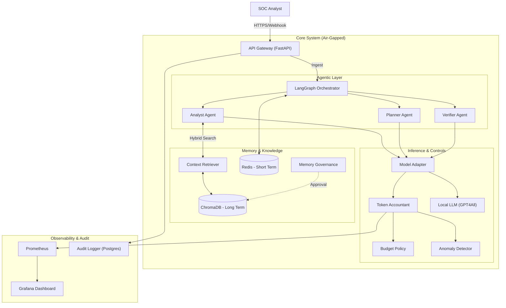

# Secure Agentic SOC Co-Pilot: System Architecture & Design

**Version:** 1.0
**Date:** 2026-01-05
**Author:** AI Architecture Team
**Status:** Production-Ready MVP

---

## 1. Executive Architecture Summary

The **Secure Agentic SOC Co-Pilot** is a localized, autonomous security analysis system designed to operate within strict financial and governance boundaries. It solves the problem of "Alert Fatigue" by automating the Triage, Analysis, and Remediation Planning phases of the SOC lifecycle. Unlike standard "Chat with PDF" solutions, this architecture enforces **Defense-in-Depth** via a micro-agent graph (`LangGraph`), **FinOps Controls** (Token Accounting), and **Cryptographic Audit Trails**. It is designed for air-gapped deployment using quantized local models (`GPT4All`), ensuring zero data egress.

---

## 2. Reference Architecture

### 2.1 High-Level Component Diagram

### 2.2 Component Breakdown

| Layer | Component | Technology | Responsibility |
| :--- | :--- | :--- | :--- |
| **Interface** | **API Gateway** | FastAPI | Ingests alerts, enforces RBAC (`api/routes/approval.py`), validates schemas (`api/schemas.py`), and sanitizes input (`api/security.py`). |
| **Orchestration** | **LangGraph** | LangGraph | Manages the state machine (`langgraph/state.py`) and workflow (`langgraph/graph.py`). Ensures deterministic transitions between agents. |
| **Agents** | **Analyst** | Python/LLM | (`langgraph/nodes/analyst.py`) Correlates alerts with context. Maps to MITRE ATT&CK. |
| | **Planner** | Python/LLM | (`langgraph/nodes/planner.py`) Generates JSON remediation plans. |
| | **Verifier** | Python/LLM | (`langgraph/nodes/verifier.py`) The "Internal Affairs" agent. Validates plans against policy and context (Groundedness). |
| **Memory** | **Retriever** | Chroma/BM25 | (`langgraph/memory/retriever.py`) Hybrid search for SOPs and historical incidents. |
| | **Governance** | Python | (`langgraph/memory/governance.py`) Enforces human approval before writing new knowledge to the DB. |
| **FinOps** | **Accountant** | Middleware | (`middleware/accounting.py`) Intercepts every model call. Calculates cost. |
| | **Budget** | Policy | (`finops/budget.py`) Enforces hard daily limits (e.g., $5.00/day). |
| **Inference** | **Local Adapter** | GPT4All | (`models/local_adapter.py`) Runs quantized models locally. No API keys, no cloud bills. |

---

## 3. Threat Model (Agentic & Non-Agentic)

We assume the input (Alerts) can be malicious (Prompt Injection via logs).

| Threat | Attack Surface | Impact | Mitigation Controls | Residual Risk |
| :--- | :--- | :--- | :--- | :--- |
| **Prompt Injection** | Alert Payload (Summary/Logs) | Agent ignores instructions, executes attacker goals. | **1. Input Sanitization**: `api/security.py` strips control chars. **2. System Prompts**: Immutable prompts in `models/prompts.py`. **3. LLM Guardrail**: `verifier.py` checks input safety. | Low |
| **Hallucination** | Remediation Plan | Agent suggests dangerous/non-existent commands. | **1. Groundedness Check**: `OutputVerifier` checks if steps are supported by Context. **2. Human Approval**: `approval.py` requires RBAC sign-off. | Medium |
| **Resource Exhaustion** | Inference Loop | Infinite loops drain CPU/Budget. | **1. Budget Policy**: Hard limit ($5/day). **2. Rate Limiting**: Redis-backed limiter on API. **3. Anomaly Detection**: Z-Score alerts on token spikes. | Low |
| **Memory Poisoning** | RAG Knowledge Base | Attacker injects false SOPs. | **1. Governance**: `governance.py` requires human approval for ALL memory writes. **2. Source Tracking**: `Provenance` object links every plan to a doc ID. | Low |
| **Privilege Escalation** | Approval API | Agent approves its own plan. | **1. RBAC**: `test_approval.py` proves Agents cannot call `/approve`. **2. Signed Actions**: (Roadmap) Cryptographic signatures. | Low |

---

## 4. Security & Governance Controls

### 4.1 Build-Time Controls
*   **Red Teaming**: The `tests/security/run_redteam.py` script runs a corpus of known attacks (`injection.yaml`) against the Verifier during CI/CD. Deployment fails if any attack passes.
*   **Dependency Management**: Minimal dependencies, pinned versions.

### 4.2 Run-Time Controls
*   **Policy Engine**: `langgraph/agents/verifier.py` uses Regex to instantly block dangerous commands (`rm -rf`, `sudo`) before they even reach the LLM.
*   **Sandboxing**: The Agent has **NO** execution tools. It can only *propose* a plan (JSON), not run it. Execution is left to the Human or a separate, strictly scoped Executor (future).

### 4.3 Post-Incident Controls
*   **Audit Logging**: `api/audit.py` logs every decision, input hash, and policy verdict to Postgres.
*   **Forensics**: The `Remediation` object contains `prompt_hash` and `model_version` to reconstruct exactly why the AI made a decision.

---

## 5. FinOps & Accounting Architecture

To ensure commercial rationality, the system treats **Compute as Currency**.

*   **The Ledger**: `middleware/accounting.py` acts as a middleware layer. It is impossible to call the Model without passing through the Accountant.
*   **Unit Economics**:
    *   **Cost per Token**: Configurable (e.g., $0.002/1k).
    *   **Budget**: `finops/budget.py` maintains a rolling daily spend.
    *   **Anomaly Detection**: `finops/anomaly.py` uses statistical baselines to detect "Runaway Agents" (e.g., an agent that gets stuck in a loop generating gigabytes of text).

---

## 6. Observability & Controls Dashboard

We measure what matters for Security and Operations.

### 6.1 Security Metrics (`infra/observability.py`)
*   `prompt_injection_attempts_total`: Counter of blocked attacks.
*   `policy_violations_total`: Counter of plans rejected by the Verifier.
*   `decision_confidence_distribution`: Histogram of AI confidence.

### 6.2 FinOps Metrics
*   `budget_spend_daily_usd`: Gauge showing real-time burn rate.
*   `token_usage_total`: Split by `prompt` vs `completion`.

### 6.3 Operational Metrics
*   `agent_latency_seconds`: Time to generate a plan.
*   `approval_wait_seconds`: The "Human Bottleneck" metric.

---

## 7. Implementation Plan (30/60/90)

### Phase 1: The "Safe Brain" (Current Status - MVP)
*   **Goal**: Secure Ingestion, Analysis, and Planning. No Execution.
*   **Status**: **COMPLETE**.
    *   API Gateway & RBAC ✅
    *   LangGraph Orchestration ✅
    *   Local Inference (GPT4All) ✅
    *   FinOps Middleware ✅
    *   Red Team Pipeline ✅

### Phase 2: The "Connected Analyst" (Next 30 Days)
*   **Goal**: Integration with real SIEMs and Ticketing systems.
*   **Tasks**:
    *   Implement `JiraConnector` and `SplunkConnector` tools.
    *   Enhance `Retriever` to fetch live logs, not just static docs.
    *   Deploy to Kubernetes with Sidecar pattern for the Model.

### Phase 3: The "Autonomous Responder" (Next 60 Days)
*   **Goal**: Limited autonomous execution for low-risk tasks.
*   **Tasks**:
    *   Create `Executor` agent with strictly scoped permissions (e.g., "Block IP on Firewall").
    *   Implement "Human-on-the-Loop" (Async approval) instead of "Human-in-the-Loop".
    *   Full Audit Trail export to immutable storage (WORM).

---

## 8. Decision Log & Trade-offs

| Decision | Option Selected | Trade-off | Rationale |
| :--- | :--- | :--- | :--- |
| **Model Hosting** | **Local (GPT4All)** | High Latency, Lower Intelligence | **Security**. Zero data egress is non-negotiable for SOC data. Zero cost allows infinite testing. |
| **Orchestration** | **LangGraph** | Complexity | **Control**. We need a state machine (DAG) to enforce the `Verify` step. Linear chains (LangChain) are too fragile for safety-critical ops. |
| **Guardrails** | **Hybrid (Regex + LLM)** | Latency (2x calls) | **Safety**. Regex catches obvious attacks instantly; LLM catches subtle context attacks. Redundancy is required. |
| **Memory** | **Governance Queue** | Slower Learning | **Integrity**. Preventing "Poisoned Knowledge" is more important than fast learning. Humans must vet all SOPs. |

---
