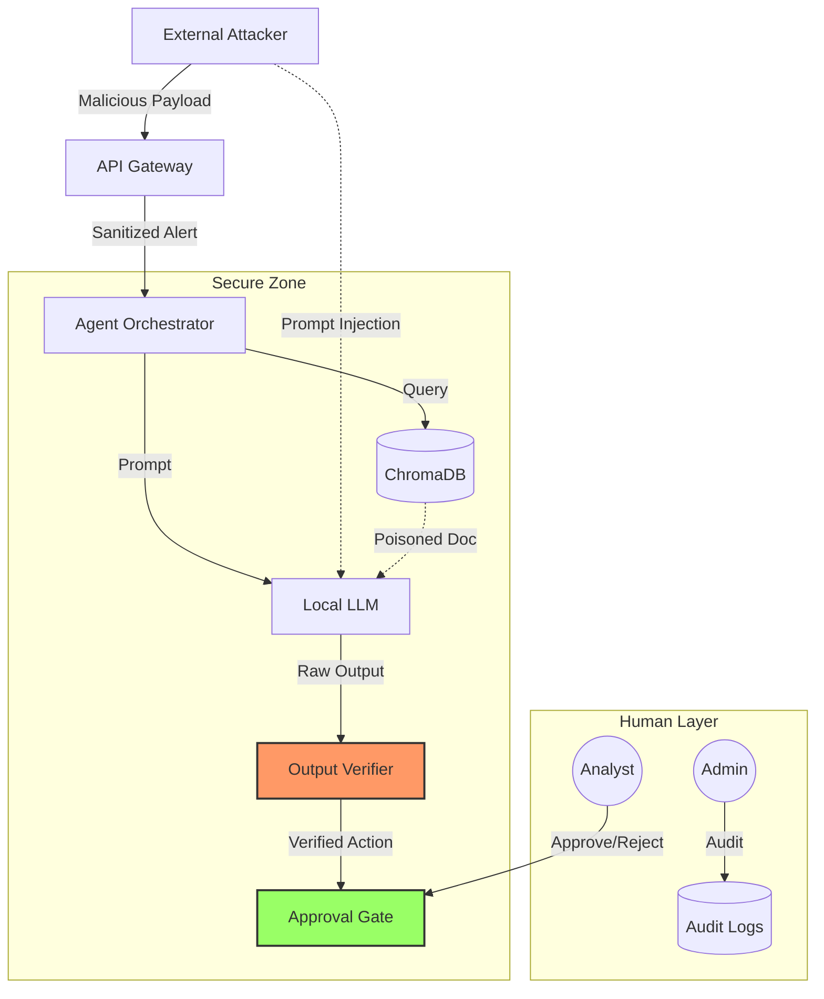

# Threat Model & Data Flow

## Threat Flow Diagram

## Attack Surfaces & Mitigations

| Surface | Threat | Mitigation |
|---------|--------|------------|
| **Ingress** | Malformed JSON, Overload | Strict Schema, Rate Limiting |
| **Prompting** | Injection, Jailbreak | Immutable System Prompt, Input Sanitization, Output Verifier |
| **Retrieval** | Poisoned Context | Source Allowlist, Write Governance |
| **Execution** | Unauthorized Action | RBAC, Human Approval, No Auto-Execute |
| **Logs** | PII Leakage | Redaction, Hashing |
